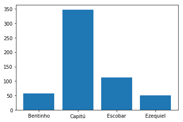
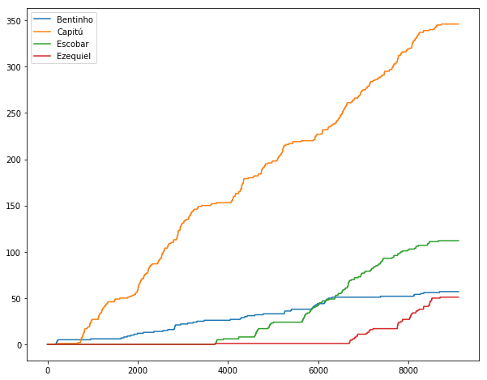

# Aula 01: Apresentação

## Objetivo

* Mostrar algums conceitos básicos de Python
* Entender como configurar um ambiente

## Resultado Esperado

* Gráfico simples de frequencia de palavras em dom-casmurro.

## Imports básicos

Código Python não é tão diferente de outras linguagens. Geralmente vamos precisar de algumas bibliotecas. Para isto, fazemos um import. Abaixo estamos usando:

1. Biblioteca de plots, `matplotlib`
1. Biblioteca de vetores, `numpy`
1. Biblioteca de expressões regulares.

Você já deve ter usado algumas dessas no curso de `Álgebra Linear Computacional`. Caso tenha feita o curso em `scilab`, não tem problemas. Python tem uma sintaxe simples que não deve ser problema para um aluno do quarto período. Veja os capítulo 3, 4, 5 e 6 do https://www.inferentialthinking.com. Ou o Capítulo 1/2 do https://jakevdp.github.io/PythonDataScienceHandbook/. Ou o Capítulo 2 do Data Science from Scratch!


```python
import matplotlib.pyplot as plt
import numpy as np
import re
```

A linha abaixo serve para que figuras sejam renderizadas no browser. Nem sempre é necessário.


```python
plt.ion()
```

Note que de forma similar ao ambiente científico em Scilab/Matlab, podemos realizar aritmética básica direto no notebook!


```python
1 + 1
```


    2


```python
x = 2
```


```python
y = x + 8
```


```python
y
```


    10


```python
print(y)
```

    10


Tipos de dados, listas e dicionários.

Uma das vantagens de Python em relação a linguagem C é que já temos uma série de estruturas de dados disponíveis. Em particular, o código abaixo faz uso de uma lista chamada livro_inteiro.

Para entender como fazer uso da lista, você pode fazer help(list)


```python
l = list()
help(l)
```

    Help on list object:
    
    class list(object)
     |  list() -> new empty list
     |  list(iterable) -> new list initialized from iterable's items
     |  
     |  Methods defined here:
     |  
     |  __add__(self, value, /)
     |      Return self+value.
     |  
     |  __contains__(self, key, /)
     |      Return key in self.
     |  
     |  __delitem__(self, key, /)
     |      Delete self[key].
     |  
     |  __eq__(self, value, /)
     |      Return self==value.
     |  
     |  __ge__(self, value, /)
     |      Return self>=value.
     |  
     |  __getattribute__(self, name, /)
     |      Return getattr(self, name).
     |  
     |  __getitem__(...)
     |      x.__getitem__(y) <==> x[y]
     |  
     |  __gt__(self, value, /)
     |      Return self>value.
     |  
     |  __iadd__(self, value, /)
     |      Implement self+=value.
     |  
     |  __imul__(self, value, /)
     |      Implement self*=value.
     |  
     |  __init__(self, /, *args, **kwargs)
     |      Initialize self.  See help(type(self)) for accurate signature.
     |  
     |  __iter__(self, /)
     |      Implement iter(self).
     |  
     |  __le__(self, value, /)
     |      Return self<=value.
     |  
     |  __len__(self, /)
     |      Return len(self).
     |  
     |  __lt__(self, value, /)
     |      Return self<value.
     |  
     |  __mul__(self, value, /)
     |      Return self*value.
     |  
     |  __ne__(self, value, /)
     |      Return self!=value.
     |  
     |  __new__(*args, **kwargs) from builtins.type
     |      Create and return a new object.  See help(type) for accurate signature.
     |  
     |  __repr__(self, /)
     |      Return repr(self).
     |  
     |  __reversed__(...)
     |      L.__reversed__() -- return a reverse iterator over the list
     |  
     |  __rmul__(self, value, /)
     |      Return value*self.
     |  
     |  __setitem__(self, key, value, /)
     |      Set self[key] to value.
     |  
     |  __sizeof__(...)
     |      L.__sizeof__() -- size of L in memory, in bytes
     |  
     |  append(...)
     |      L.append(object) -> None -- append object to end
     |  
     |  clear(...)
     |      L.clear() -> None -- remove all items from L
     |  
     |  copy(...)
     |      L.copy() -> list -- a shallow copy of L
     |  
     |  count(...)
     |      L.count(value) -> integer -- return number of occurrences of value
     |  
     |  extend(...)
     |      L.extend(iterable) -> None -- extend list by appending elements from the iterable
     |  
     |  index(...)
     |      L.index(value, [start, [stop]]) -> integer -- return first index of value.
     |      Raises ValueError if the value is not present.
     |  
     |  insert(...)
     |      L.insert(index, object) -- insert object before index
     |  
     |  pop(...)
     |      L.pop([index]) -> item -- remove and return item at index (default last).
     |      Raises IndexError if list is empty or index is out of range.
     |  
     |  remove(...)
     |      L.remove(value) -> None -- remove first occurrence of value.
     |      Raises ValueError if the value is not present.
     |  
     |  reverse(...)
     |      L.reverse() -- reverse *IN PLACE*
     |  
     |  sort(...)
     |      L.sort(key=None, reverse=False) -> None -- stable sort *IN PLACE*
     |  
     |  ----------------------------------------------------------------------
     |  Data and other attributes defined here:
     |  
     |  __hash__ = None
    


```python
# Da mesma forma
l = []
```


```python
l.append('a') # adiciona no fim da lista
l
```


    ['a']


```python
l.append(2)
l
```


    ['a', 2]


Abrimos arquivos com "with open". O with não é necessário, mas ao utilizar o mesmo criamos um contexto onde o arquivo é aberto dentro do mesmo. Após sair do bloco with, o arquivo já é fechado. A função print serve para imprimir dados. Note como no notebook tudo ocorre no browser.


```python
with open('dom-casmurro.txt') as dom_casmurro:
    print(dom_casmurro.readline())
```

    The Project Gutenberg EBook of Dom Casmurro, by Machado de Assis
    


Além do mais agora estamos fazendo uso de um laço for. Note que não temos chaves nem ; em nenhum momento. Blocos de código em Python são definidos pela identação.


```python
livro_inteiro = []
with open('dom-casmurro.txt') as dom_casmurro:
    for line in dom_casmurro:
        livro_inteiro.append(line.strip())
```


```python
livro_inteiro[103] # acessando o segundo elemento da lista
```


    'Agora que expliquei o titulo, passo a escrever o livro. Antes disso,'


Python é bastante útil para fazer uso de expressões regulares. Minha primeira tentativa foi identificar os nomes através de expressões regulares. Deu errado :). Motivos:

- Acentos
- Pontuação


```python
for linha in livro_inteiro:
    for nome in re.findall(r"^[A-Z][a-z]+?\s+", linha):
        print(nome)
```

    The 
    This 
    Release 
    Produced 
    Literature 
    Do 
    Uma 
    Engenho 
    Tudo 
    Do 
    Agora 
    Vivo 
    Se 
    Quiz 
    Fiquei 
    Tive 
    Ia 
    Minha 
    Tio 
    Creio 
    Minha 
    Um 
    Nem 
    Era 
    Voltou 
    Tinha 
    Teve 
    Tio 
    Tio 
    Tinha 
    Era 
    Uma 
    Tambem 
    Minha 
    Albuquerque 
    Santiago 
    Tenho 
    Concluo 
    Aqui 
    Mas 
    Verdadeiramente 
    Agora 
    Deus 
    Com 
    Satanaz 
    Foi 
    As 
    Os 
    Juram 
    Shakespeare 
    Acceito 
    Que 
    Os 
    Prazos 
    Minha 
    Quando 
    Ultimamente 
    Na 
    Parei 
    Tijolos 
    Um 
    Era 
    Com 
    Tudo 
    De 
    Em 
    Caminhei 
    Quiz 
    Os 
    As 
    Pensei 
    Nisto 
    Tudo 
    Conhecia 
    Faltava 
    Outra 
    Outra 
    Era 
    Olhei 
    Que 
    Padua 
    Fortunata 
    Seja 
    Padua 
    Nos 
    Com 
    Ou 
    Ou 
    Tal 
    Os 
    Um 
    Pae 
    Fiquei 
    Disse 
    Em 
    Dito 
    Como 
    Justina 
    Estremeci 
    Sem 
    Quando 
    Afinal 
    Mil 
    Levantei 
    Mas 
    Afinal 
    Era 
    Cogitei 
    Era 
    Prima 
    Na 
    Enruguei 
    Justina 
    Note 
    Ciumes 
    Creio 
    Prazo 
    Creio 
    Ao 
    De 
    No 
    Tinhamos 
    Durante 
    Todo 
    Os 
    Timidez 
    As 
    Pela 
    Ha 
    Levantou 
    Ao 
    Ao 
    Na 
    Em 
    Quanto 
    Vi 
    Uma 
    Tudo 
    Assim 
    Pela 
    Opas 
    Fiquei 
    As 
    Era 
    Era 
    Um 
    Sabia 
    Queria 
    Olhos 
    Tudo 
    Fui 
    Rhetorica 
    Continuei 
    Em 
    Grande 
    Quando 
    Des 
    Sou 
    Ouvimos 
    Como 
    Corri 
    De 
    Suppuz 
    Quando 
    Cabral 
    Padre 
    Conheci 
    Minha 
    Se 
    Ideia 
    Era 
    Padre 
    Papae 
    Penso 
    Nisto 
    Fortunata 
    Ouvimos 
    Que 
    Quando 
    Agora 
    Padre 
    Trazia 
    Padre 
    Prima 
    Padre 
    Tendo 
    Falava 
    Uma 
    Ficando 
    Minha 
    Toda 
    Tentei 
    Enxuguei 
    Como 
    Deus 
    Creio 
    Vi 
    Caminhou 
    Quizera 
    No 
    Ha 
    Mas 
    De 
    Tambem 
    Todas 
    Fez 
    Era 
    Ao 
    Hei 
    Ao 
    Palavra 
    Que 
    Logo 
    Abane 
    Abane 
    Quanto 
    As 
    As 
    Outra 
    Fosse 
    Para 
    As 
    Juramento 
    Tinha 
    Jurou 
    Comprehendeis 
    Podiamos 
    Eramos 
    Uma 
    Eis 
    Haviamos 
    Um 
    Mezes 
    Nosso 
    Era 
    Ha 
    Entre 
    Entre 
    Ja 
    Fui 
    Suspirou 
    Tive 
    Que 
    Tinha 
    Fui 
    Assim 
    Panegyrico 
    No 
    Contrario 
    Antes 
    Vinte 
    Um 
    Dita 
    Como 
    Quem 
    Sem 
    Trabalhei 
    Um 
    Tudo 
    Luiz 
    Eis 
    Era 
    De 
    Escobar 
    Morreu 
    De 
    Foi 
    Dias 
    Eu 
    Creio 
    Mas 
    Vou 
    Vindo 
    Convivas 
    Ha 
    Como 
    Querido 
    Assim 
    Querido 
    Como 
    Excellentissima 
    Neste 
    Dias 
    Desta 
    Uma 
    Uma 
    Estou 
    Por 
    Dias 
    Outra 
    Cuidei 
    Metades 
    Fiquei 
    Tudo 
    Quanto 
    Nunca 
    Sobre 
    Uma 
    Relendo 
    Antes 
    Era 
    Chegou 
    Era 
    Em 
    Foi 
    Padua 
    Era 
    Justina 
    Prima 
    Caso 
    Como 
    Um 
    Cuidaram 
    Na 
    Municipaes 
    Enxuguei 
    Adiemos 
    Poucos 
    Montaigne 
    Por 
    Nem 
    Pelo 
    Um 
    Ouvi 
    Depois 
    Rezei 
    Era 
    Quis 
    Visita 
    Em 
    Assim 
    Era 
    Tio 
    Escobar 
    Os 
    Nunca 
    Escobar 
    Uma 
    Nem 
    Desta 
    Ella 
    Eu 
    Assim 
    Nem 
    Na 
    Tal 
    Ha 
    Dias 
    Para 
    Escapei 
    Eu 
    Da 
    Ao 
    Tinha 
    Ia 
    Consentiu 
    Prazer 
    Contando 
    Segredo 
    De 
    Dei 
    Que 
    Quando 
    Vamos 
    Com 
    Venhamos 
    Venhamos 
    Um 
    Um 
    Succedeu 
    Na 
    Has 
    Tal 
    Uma 
    Assim 
    Prima 
    Tambem 
    Repeti 
    Gurgel 
    Eu 
    Nem 
    Murmurei 
    Um 
    No 
    Quiz 
    Tal 
    Suspendamos 
    Isto 
    Verdade 
    Eu 
    Era 
    Chegara 
    Era 
    Fica 
    Cada 
    Tudo 
    Quando 
    Um 
    Voltaria 
    Contava 
    Abri 
    Minha 
    Prima 
    No 
    Manduca 
    Fui 
    Ou 
    Fui 
    Mas 
    Morreu 
    Achado 
    Manduca 
    Quero 
    Um 
    Quanto 
    Escobar 
    Minha 
    Todos 
    Cosme 
    Justina 
    Quando 
    Estavamos 
    Mostrei 
    Com 
    Ideias 
    Mas 
    Criado 
    Acceitei 
    Fiquei 
    Fiquei 
    Escobar 
    Escobar 
    No 
    Bem 
    Vi 
    Um 
    Expuz 
    Esta 
    Quando 
    Os 
    Escobar 
    Tudo 
    Tinha 
    Cinco 
    Venceu 
    Tudo 
    Cosme 
    Escobar 
    Minha 
    Ainda 
    Minha 
    No 
    Uma 
    Ainda 
    No 
    Pois 
    Em 
    Ao 
    De 
    Imagina 
    De 
    Concordava 
    Mocetona 
    As 
    Ao 
    Eu 
    Escobar 
    Sancha 
    Escobar 
    Jantar 
    Andarahy 
    Escobar 
    Os 
    No 
    Embora 
    Eram 
    Nem 
    Dez 
    Quanto 
    Sabes 
    Tive 
    No 
    Escobar 
    Ciumes 
    Se 
    Um 
    Pois 
    Escusai 
    Usavamos 
    Escobar 
    Era 
    Contei 
    Um 
    Rasgos 
    Aos 
    Gostava 
    Fazia 
    Um 
    Taes 
    Um 
    Os 
    Contado 
    Foi 
    As 
    Tal 
    Embargos 
    Por 
    Eram 
    Em 
    Antes 
    Aproveitei 
    Quando 
    Ao 
    Duvidas 
    Vamos 
    Escobar 
    Quando 
    Palavra 
    Fomos 
    Pouco 
    Quando 
    Ezequiel 
    Filho 
    Apalpei 
    Quiz 
    Biblia 
    Eu 
    Amigos 
    Velha 
    Um 
    Os 
    Como 
    Escobar 
    Tudo 
    Tudo 
    Sancha 
    Europa 
    Sancha 
    Dalli 
    Tive 
    Talvez 
    Quando 
    Sancha 
    Capricho 
    Os 
    Na 
    Uma 
    Naquelle 
    No 
    Em 
    Assim 
    Como 
    Poucas 
    Olhos 
    Muitos 
    As 
    Era 
    Era 
    As 
    Uma 
    Priamo 
    Pouco 
    Neste 
    Quando 
    Perto 
    Divina 
    Punhado 
    Como 
    No 
    Inventariei 
    Rinovalatte 
    Um 
    Ella 
    Anterior 
    Foi 
    Era 
    Assim 
    Nem 
    Escobar 
    Antes 
    Fui 
    Uma 
    Um 
    Jantei 
    Vaguei 
    Cheguei 
    Escobar 
    Desdemona 
    Quando 
    Segundo 
    Se 
    Ezequiel 
    Quando 
    Eis 
    Desta 
    Grande 
    Concertou 
    Deus 
    Palavra 
    Volta 
    Ficando 
    Os 
    No 
    Aqui 
    Ao 
    Embarquei 
    Uma 
    Morreu 
    Abrimos 
    Uma 
    Assim 
    Esta 
    Corri 
    Tudo 
    Vim 
    Se 
    Estendeu 
    Ezequiel 
    Senhor 
    Ao 
    Sorriu 
    Como 
    Ellas 
    Capitulo 
    End 
    This 
    Produced 
    Literature 
    Updated 
    Creating 
    States 
    To 
    Project 
    Section 
    Project 
    United 
    Project 
    This 
    United 
    License 
    Vanilla 
    Gutenberg 
    Gutenberg 
    Section 
    Literary 
    Project 
    Gutenberg 
    Defect 
    Section 
    Project 
    Volunteers 
    Gutenberg 
    Archive 
    Sections 
    Section 
    The 
    Revenue 
    Archive 
    The 
    Lake 
    For 
    Chief 
    Section 
    Literary 
    Project 
    The 
    While 
    International 
    Please 
    Section 
    Professor 
    Project 
    Most 
    This 
    Archive 


Então decidi forçar a barra e olhar para os principais personagens. Aqui começo a fazer uso da biblioteca numpy. A mesma tem uma função np.char.count que conta a quantidade de vezes que uma sub-string ocorre em um texto. Então, estamos contando para cada linha do texto a quantidade de menções para cada personagem.

Além do mais, também estou usando o dicionário (mapa de ED) para guardar as contagens.


```python
mapa = {}
mapa[1] = 2
mapa[2] = 'Flavio'
```


```python
mapa
```


    {1: 2, 2: 'Flavio'}


```python
nomes = ['Bentinho', 'Capitú', 'Escobar', 'Ezequiel']
contagens = {}
for nome in nomes:
    contagens[nome] = 0
    
for linha in livro_inteiro:
    for nome in nomes:
        contagens[nome] += np.char.count(linha, nome)
```


```python
contagens
```


    {'Bentinho': 57, 'Capitú': 346, 'Escobar': 112, 'Ezequiel': 51}


```python
y_values = np.zeros(len(nomes))
for i, nome in enumerate(nomes):
    y_values[i] = contagens[nome]
```


```python
plt.bar([1, 2, 3, 4], y_values)
plt.xticks([1, 2, 3, 4], nomes)
```


    ([<matplotlib.axis.XTick at 0x7fdc6bb54b70>,
      <matplotlib.axis.XTick at 0x7fdc6bb54470>,
      <matplotlib.axis.XTick at 0x7fdc6bb542e8>,
      <matplotlib.axis.XTick at 0x7fdc6bb15630>],
     <a list of 4 Text xticklabel objects>)





```python
mencoes_por_linha = {}
for nome in nomes:
    mencoes_por_linha[nome] = np.zeros(len(livro_inteiro))
    
for i, linha in enumerate(livro_inteiro):
    for nome in nomes:
        mencoes_por_linha[nome][i] += np.char.count(linha, nome)
```


```python
plt.figure(figsize=(10, 8))
for nome in nomes:
    plt.plot(np.cumsum(mencoes_por_linha[nome]), label=nome)
plt.legend()
```


    <matplotlib.legend.Legend at 0x7fdc6ba9ae48>




